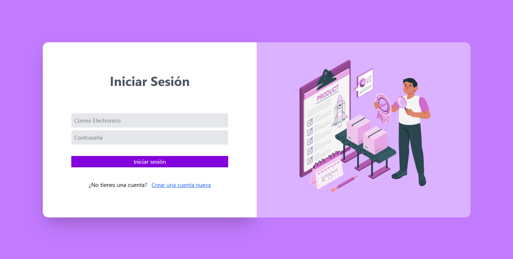
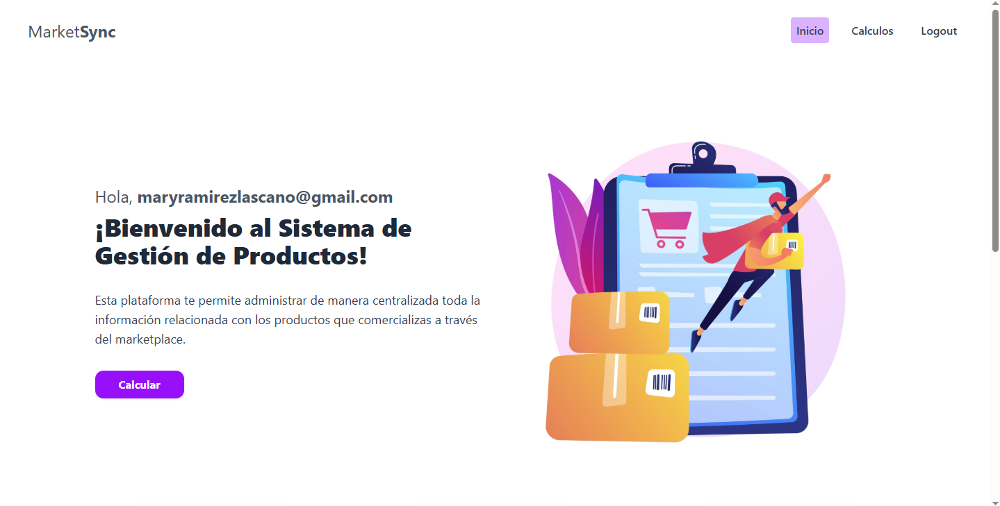
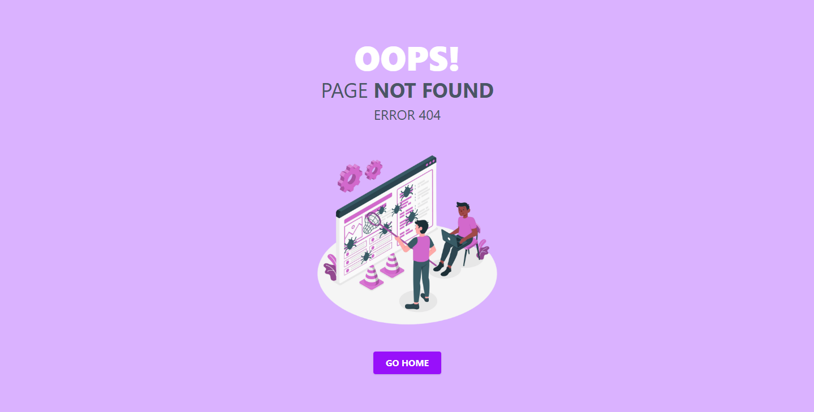

# 📦 Frontend MarketSync App

Este es el **frontend** de una aplicación web para gestionar productos, realizar cálculos y autenticación de usuarios, que se comunica con un backend personalizado y una API externa tipo marketplace.

## 🚀 Tecnologías Utilizadas

- **React** con React Router v6
- **Tailwind CSS** para estilos
- **React Hook Form + Zod** para validaciones
- **Context API** para manejo de autenticación
- **Axios** para llamadas HTTP

---

## 🧭 Navegación

- `/` → Página de login
- `/register` → Registro de nuevos usuarios
- `/home` → Descripcion de la aplicacion
- `/calculos` → Página con tabla de productos
- `*` → Página 404 para rutas no encontradas

---

## 🧩 Estructura de Carpetas

```
src/
│
├── assets/               # Imagenes
├── services/             # Configuración de axios
├── pages/                # Páginas principales (Login, Register, Calculos)
├── components/           # Componentes reutilizables (layout, formulario, tabla, etc.)
├── context/              # AuthProvider para control de sesión
├── hooks/                # Hooks personalizados para login, registro, carga de productos
└── App.jsx               # Configuración de rutas y layout principal
```

---

## 🛠 Instalación y uso

1. Clonar el repositorio:

   ```bash
   git clone https://github.com/susanaromero8/marketsync-front.git
   cd marketsync-front
   ```

2. Instalar dependencias:

   ```bash
   npm install
   ```

3. Ejecutar en modo desarrollo:

   ```bash
   npm run dev
   ```

4. El frontend espera comunicarse con:
   - API interna en `http://localhost:3000`
   - API externa de productos tipo marketplace en `http://localhost:4000`

---

## 📌 Características principales

- **Autenticación con contexto**: login persistente y rutas protegidas según el estado del usuario.
- **Validaciones con Zod**: tanto en login como en registro, con mensajes de error amigables.
- **Tabla de productos**: obtenida desde backend, integrada en una vista dedicada para cálculos.
- **Redireccionamiento automático** según el estado de sesión.

---

## 📷 Capturas







---
